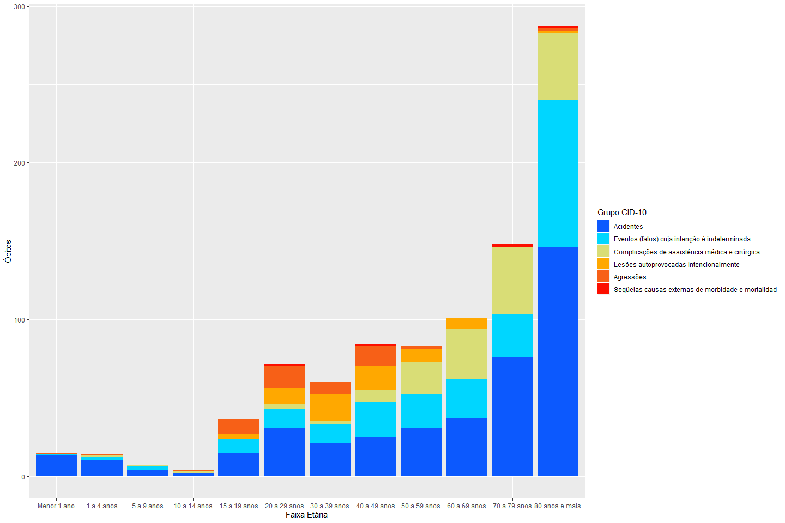

Santo André
================

  - [1.1. DESCRIÇÃO E ANALISE das principais características
    epidemiológicas e dos problemas de saúde mais prevalentes em Santo
    André.](#descrição-e-analise-das-principais-características-epidemiológicas-e-dos-problemas-de-saúde-mais-prevalentes-em-santo-andré.)
      - [1.1.1. Envelhecimento
        Populacional](#envelhecimento-populacional)
      - [1.1.2. Causas de Morte](#causas-de-morte)
      - [1.1.3. Doenças do Aparelho
        Circulatório](#doenças-do-aparelho-circulatório)
      - [1.1.3. Neoplasias](#neoplasias)
      - [1.1.4. Doenças do Aparelho
        Respiratório](#doenças-do-aparelho-respiratório)
      - [1.1.5. Causas Externas](#causas-externas)
      - [1.1.6. Doenças do Aparelho
        Digestivo](#doenças-do-aparelho-digestivo)

## 1.1. DESCRIÇÃO E ANALISE das principais características epidemiológicas e dos problemas de saúde mais prevalentes em Santo André.

### 1.1.1. Envelhecimento Populacional

**Pirâmide Etária, Santo André, 2000 e 2010**

<!-- -->

  - População de Santo André atravessando um processo de envelhecimento
    populacional;
  - No último censo (2010), a faixa etária com o maior número de pessoas
    foi a de 25 a 29 anos.
  - Aumento de idosos, aumento de pessoas dependentes, seja por doenças,
    seja por fragilidade relacionada à velhice.

| Faixa Etária     |   Homem |  Mulher |   Total |
| :--------------- | ------: | ------: | ------: |
| 0 a 4 anos       |  20.138 |  19.164 |  39.302 |
| 5 a 9 anos       |  20.982 |  20.349 |  41.331 |
| 10 a 14 anos     |  24.218 |  23.613 |  47.831 |
| 15 a 19 anos     |  25.040 |  24.500 |  49.540 |
| 20 a 24 anos     |  28.838 |  28.534 |  57.372 |
| 25 a 29 anos     |  30.191 |  30.630 |  60.821 |
| 30 a 34 anos     |  27.569 |  29.217 |  56.786 |
| 35 a 39 anos     |  25.086 |  27.268 |  52.354 |
| 40 a 44 anos     |  24.115 |  26.225 |  50.340 |
| 45 a 49 anos     |  23.187 |  25.775 |  48.962 |
| 50 a 54 anos     |  20.288 |  23.436 |  43.724 |
| 55 a 59 anos     |  16.821 |  19.707 |  36.528 |
| 60 a 64 anos     |  12.657 |  15.803 |  28.460 |
| 65 a 69 anos     |   8.974 |  11.869 |  20.843 |
| 70 a 74 anos     |   7.154 |   9.908 |  17.062 |
| 75 a 79 anos     |   4.700 |   7.131 |  11.831 |
| 80 a 89 anos     |   4.075 |   7.642 |  11.717 |
| 90 a 99 anos     |     411 |   1.149 |   1.560 |
| 100 anos ou mais |      14 |      29 |      43 |
| Total            | 324.458 | 351.949 | 676.407 |

### 1.1.2. Causas de Morte

**Número e proporção acumulada de óbitos residentes, segundo Capítulo da
CID-10, Santo André, 2008-2017**

<!-- --> \* Cerca de
80% de todos os óbitos estão concentrados em 5 capítulos da CID-10; \* A
principal causa de morte foram as Doenças do Aparelho Circulatório,
responsáveis por cerca de 35% de todos os óbitos; \* A segunda principal
causa de morte foram as Neoplasias, seguidas das Doenças do Aparelho
Respiratório, das Causas Externas de Morbidade e Mortalidade e das
Doenças do Aparelho Digestivo.

**Número de óbitos residentes, por faixa etária e Capítulo da CID-10,
Santo André, 2008-2017**

<!-- -->

### 1.1.3. Doenças do Aparelho Circulatório

**Número de óbitos por Doenças do Aparelho Circulatório, segundo sexo e
faixa etária, Santo André, 2008-2017**

<!-- -->

  - Os óbitos por Doenças do Aparelho Circulatório estão concentrados
    nas faixas etárias mais velhas;
  - Porém, nos homens, a faixa etária com o maior número de óbitos foi a
    de 70 a 79 anos, enquanto nas mulheres, foi a de 80 anos e mais.

**Número de óbitos masculinos residentes por Doenças do Aparelho
Circulatório, segundo faixa etária e Grupo da CID-10, Santo André,
2008-2017**

    ## Joining, by = "Grupo CID-10"

<!-- -->

**Número de óbitos femininos residentes por Doenças do Aparelho
Circulatório, segundo faixa etária e Grupo da CID-10, Santo André,
2008-2017**

    ## Joining, by = "Grupo CID-10"

<!-- -->

**Número de óbitos residentes por Doenças do Aparelho Circulatório,
segundo faixa etária e Grupo da CID-10, Santo André, 2008-2017**

    ## Joining, by = "Grupo CID-10"

<!-- -->

  - Principal foram as isquêmicas do coração;
  - Em segundo lugar, as cerebrovasculares.
  - Além de causa importante de óbitos, as Doenças Cerebrovasculares
    também são responsáveis, no caso dos sobreviventes, por sequelas
    cognitivas, sensoriais e motoras que demandam reabilitação.

### 1.1.3. Neoplasias

**Número de óbitos por Neoplasias, segundo sexo e faixa etária, Santo
André, 2008-2017**
<!-- -->

  - Óbitos por Neoplasias concentrados nas faixas etárias mais velhas;

**Número de óbitos masculinos residentes por Neoplasias, segundo faixa
etária e Categoria da CID-10, Santo André, 2008-2017**

    ## Joining, by = "Categoria CID-10"

<!-- -->

  - Câncer que mais matou: de Pulmão;
  - Seguido do de próstata (aumento a partir da faixa etária dos 60 a 69
    anos);

**Número de óbitos femininos residentes por Neoplasias, segundo faixa
etária e Categoria da CID-10, Santo André, 2008-2017**

    ## Joining, by = "Categoria CID-10"

<!-- -->

  - Neoplasia que mais matou foi a de Mama;

  - Seguida pelo câncer de Pulmão;

  - Câncer de Colo de Útero não figura entre os 5 principais tipos de
    câncer.

  - Tanto para os homens, quanto para as mulheres, as Neoplasias
    Malignas do Encéfalo são a quinta maior em número de óbitos;

  - Apesar de ser um número de óbitos muito inferior em relação aos
    outros tipos de cânceres, as Neoplasias do Encéfalo, também são
    responsáveis sequelas cognitivas, sensoriais e motoras que demandam
    reabilitação.

### 1.1.4. Doenças do Aparelho Respiratório

**Número de óbitos por Doenças do Aparelho Respiratório, segundo sexo e
faixa etária, Santo André, 2008-2017**

<!-- -->

  - Os óbitos estão concentrados nas faixas etárias mais velhas;

**Número de óbitos residentes por Doenças do Aparelho Respiratório,
segundo faixa etária e Grupo da CID-10, Santo André, 2008-2017**

    ## Joining, by = "Grupo CID-10"

<!-- -->

  - A Influenza e a Pneumonia foram as principais responsáveis pelos
    óbitos por Doenças do Aparelho Respiratório;
  - Em segundo lugar aparecem as Doenças Crônicas das Vias Aéreas
    Inferiores.

### 1.1.5. Causas Externas

**Número de óbitos por Causas Externas, segundo sexo e faixa etária,
Santo André, 2008-2017**

<!-- -->

  - Observa-se uma quantidade muito maior de óbitos por Causas Externas
    nos homens;
  - Nos Homens, a maior quantidade de óbitos por Causas Externas foi
    observada na faixa etária de 20 a 29 anos;
  - Nas mulheres, a faixa etária com a maior quantidade de óbitos por
    Causas Externas foi a de 80 ano e mais.

**Número de óbitos masculinos residentes por Causas Externas, segundo
faixa etária e Grupo da CID-10, Santo André, 2008-2017**

    ## Joining, by = "Grupo CID-10"

<!-- -->

  - Considerando todas as faixas etárias, os Acidentes foram a principal
    Causa Externa responsável pelos óbitos nos homens;
  - Porém, nas faixas etárias de 15 a 19 anos, 20 a 29 anos e 30 a 39
    anos, as Agressões foram a Causa Externa que mais matou os homens;

**Número de óbitos femininos residentes por Causas Externas, segundo
faixa etária e Grupo da CID-10, Santo André, 2008-2017**

    ## Joining, by = "Grupo CID-10"

<!-- -->

  - Considerando todas as faixas etárias, os Acidentes foram a principal
    Causa Externa responsável pelos óbitos nas mulheres;

  - Tanto as lesões por Acidentes quanto as provocadas por Agressões são
    grande responsáveis por sequelas cognitivas, sensoriais e motoras
    que demandam reabilitação.

### 1.1.6. Doenças do Aparelho Digestivo

**Número de óbitos por Doenças do Aparelho Digestivo, segundo sexo e
faixa etária, Santo André, 2008-2017**

    ## Warning: Removed 1 rows containing missing values (position_stack).
    
    ## Warning: Removed 1 rows containing missing values (position_stack).

    ## Warning: Removed 1 rows containing missing values (geom_text).
    
    ## Warning: Removed 1 rows containing missing values (geom_text).

<!-- -->

  - Os homens e mulheres apresentam um padrão diferente de óbitos por
    Doenças do Aparelho Digestivo;
  - Enquanto nos homens a faixa etária com a maior quantidade de óbitos
    é a de 50 a 59 anos, nas mulheres o número de óbitos aumenta
    progressivamente com as faixas etárias.

**Número de óbitos masculinos residentes por Doenças do Aparelho
Digestivo, segundo faixa etária e Grupo da CID-10, Santo André,
2008-2017**

    ## Joining, by = "Grupo CID-10"

<!-- -->

  - No caso dos homens, a principal causa de morte por Doenças do
    Aparelho Digestivo são as Doenças do Fígado;
  - Maior número de mortes por Doenças do Fígado na faixa etária dos 50
    a 59 anos.

**Número de óbitos femininos residentes por Doenças do Aparelho
Circulatório, segundo faixa etária e Grupo da CID-10, Santo André,
2008-2017**

    ## Joining, by = "Grupo CID-10"

<!-- -->

  - No caso das mulheres, a maior causa de óbitos por Doenças do
    Aparelho Digestivo são aquelas enfermidades classificadas sob o
    grupo “Outras Doenças dos Intestinos”;

**Número de óbitos residentes por Doenças do Aparelho Circulatório,
segundo faixa etária e Grupo da CID-10, Santo André, 2008-2017**

    ## Joining, by = "Grupo CID-10"

<!-- -->

  - Desde o Decreto Nº 5.296/2004, as pessoa com ostomias são
    consideradas pessoas com deficiência física e, portanto, devem ser
    levadas em consideração nas políticas, programas e serviços de
    saúde.
